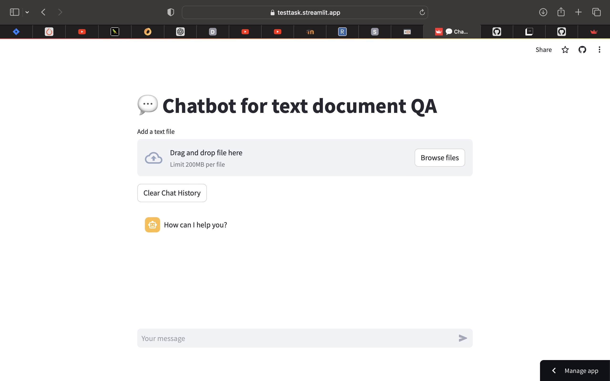
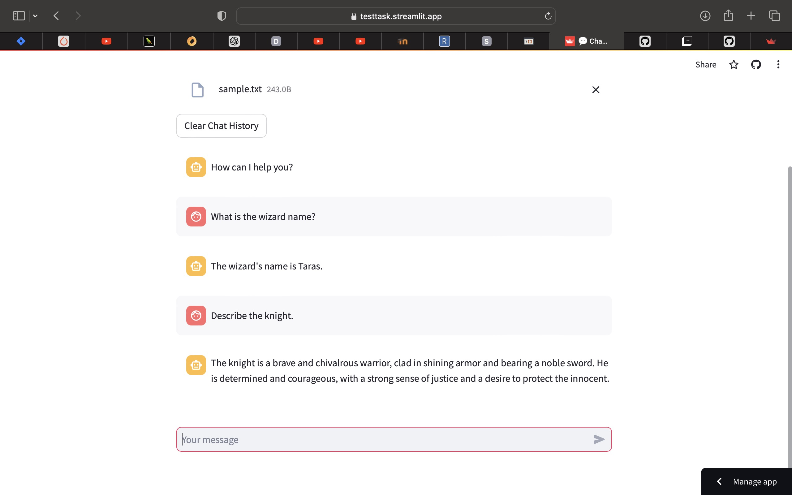

# Test task

## Task statement
This test is designed to assess your skills in building, training, fine-tuning, and hosting a language model. Pick an open-source LLM of your choice (like Llama 2), host the model on the cloud, expose that as an API, upload a sample text file, and run a sample query based on the context in the input text file to demonstrate that it is working.

## Solution
The following technologies were used to approach the aforementioned problem:
1. Llama-2-7b-chat-hf as the open source LLM.
2. The aforementioned model was loaded and configured using BentoML inference serving package. Then it was hosted on RunPod.
3. Streamlit as a web-service to create web UI.
4. The code was added to a public github repo and then was built and hosted on cloud with streamlit.

## How to use
1. Open the [link](https://testtask.streamlit.app).
2. Upload your .txt file (one can try `sample.txt` from the repo).
3. Ask a question.

## Issues
In the following chapter I describe the issues, which are recommended to be improved
1. Loading the txt file is an overkill. It is recommended to upload a file and load it straight away without saving it to disk.
